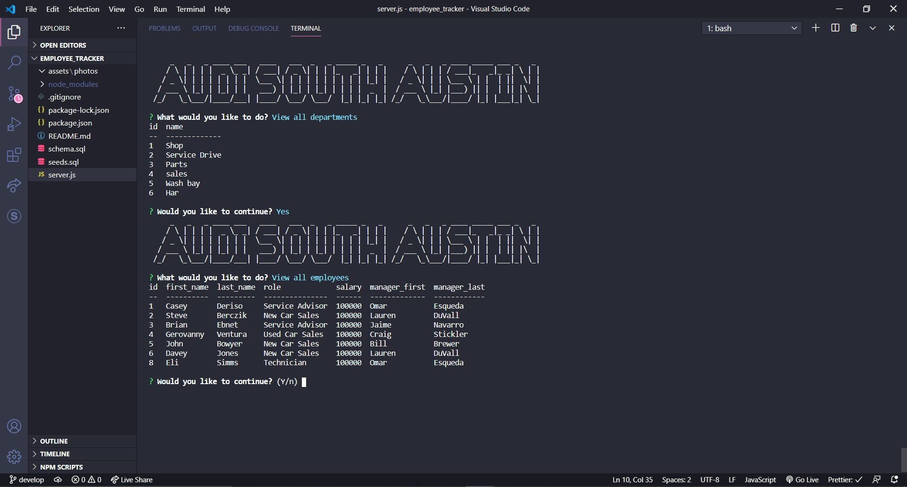

# Employee_Tracker

    

## Description

employee tracker is a command line interface application for businesses to track their employees in a SQL database. See a full list of departments, employees, and job roles. Add departments, roles and employees or update an employee role.

## Table of Contents:
* [installation](#installation)
* [usage](#usage)
* [screenshot](#screenshot)
* [credits](#credits)
* [tutorial](#tutorial)

## Installation 

This project requires both Node.js and MYSQL to be installed on your local machine. After cloning the repository to your machine, run 'npm install' to install dependencies, in index.js on lines 16 and 18, update the variables to your mysql username/password, and the application will be ready to run with the 'npm start' command!

## Usage 

Once the project is installed and ready. Create a new databse for your business by typing 'npm run db' in the command line and then type 'source schema.sql' to create new databse. otherwise, on line 20 of index.js update the databse variable to your business database name. Also, on line 10, you can chage the business variable to your business name to personalize the command line prompts!

## Screenshot

      

## Credits

This project was developed as part of the UT full stack developer bootcamp.

## Tutorial

